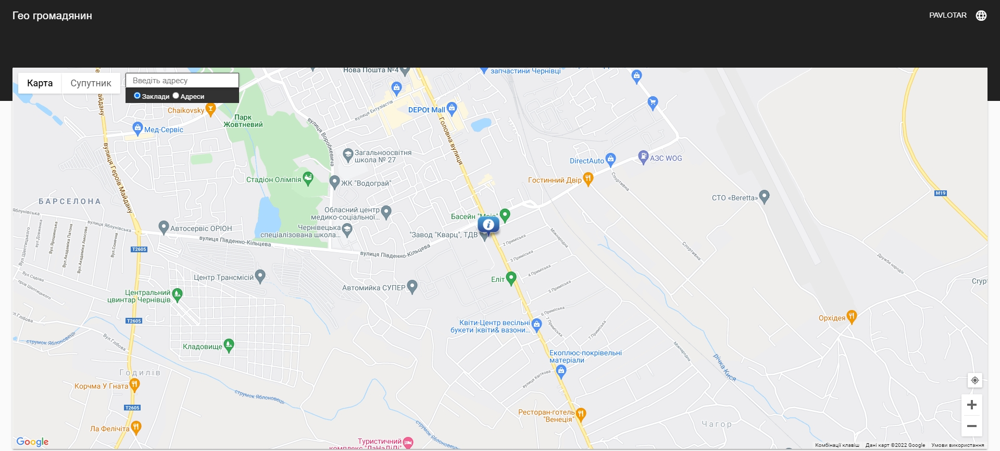
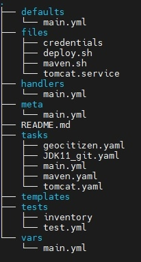

# Geo_Citizen 



___build  and deploy project on AWS infrastructure ___


## Soft && tools that was used to build and deploy the project with links how to istall:

1) [AWS - Open free tier accaunt ](https://www.youtube.com/watch?v=O1_--7IvP5g&list=PLg5SS_4L6LYsxrZ_4xE_U95AtGsIB96k9&index=4)    *(youtube guide)*
2) [AwS - Setup your profile ](https://www.youtube.com/watch?v=NBBIjFUQ2W0&list=PLg5SS_4L6LYsxrZ_4xE_U95AtGsIB96k9&index=5)   *(youtube guide)*
3) [AWS - Setup IAM, Creating Users,Groups](https://www.youtube.com/watch?v=8jbx8O3wuLg&list=PLg5SS_4L6LYsxrZ_4xE_U95AtGsIB96k9)  *(youtube guide)*
4) [Terraform - Installation on Linux](https://www.youtube.com/watch?v=lSeKvTJN2ac&list=PLg5SS_4L6LYsUzsBeN8rPe1EoqKWhMlnF&index=4) *(youtube guide)*
5) [Terraform - AWS Credentials Setup](https://www.youtube.com/watch?v=4u2HQCSuQpo&list=PLg5SS_4L6LYsUzsBeN8rPe1EoqKWhMlnF&index=7) *(youtube guide)*
6) [Terraform - Create Resources on AWS](https://www.youtube.com/watch?v=BZ2BP2l_lE4&list=PLg5SS_4L6LYsUzsBeN8rPe1EoqKWhMlnF&index=8) *(youtube guide)*
7) [Terraform - Destroy Resources on AWS](https://www.youtube.com/watch?v=O1M5V6dMONU&list=PLg5SS_4L6LYsUzsBeN8rPe1EoqKWhMlnF&index=10)*(youtube guide)*
8) [Ansible - Instalation on Ubuntu & CentOS](https://www.youtube.com/watch?v=FzmaPxz24qg&list=PLg5SS_4L6LYufspdPupdynbMQTBnZd31N&index=2)*(youtube guide)*
9) [Ansible - Conection to LINUX servers](https://www.youtube.com/watch?v=O5R6EBdaZZg&list=PLg5SS_4L6LYufspdPupdynbMQTBnZd31N&index=4) *(youtube guide)*
10) [Ansible - Rules for creating Inventory file](https://www.youtube.com/watch?v=KsBb4ezQXq8&list=PLg5SS_4L6LYufspdPupdynbMQTBnZd31N&index=6)*(youtube guide)*
11) [Ansible - First Playbook](https://www.youtube.com/watch?v=5VjcJNQ7nlI&list=PLg5SS_4L6LYufspdPupdynbMQTBnZd31N&index=10)*(youtube guide)*
12) [Ansible -  Roles](https://www.youtube.com/watch?v=9pHMZnb3JDQ&list=PLg5SS_4L6LYufspdPupdynbMQTBnZd31N&index=15)*(youtube guide)*
13) [Ansible -  Vault](https://www.youtube.com/watch?v=20g9BNilDvg&list=PLg5SS_4L6LYufspdPupdynbMQTBnZd31N&index=20)*(youtube guide)*
14) [Ansible - Galaxy](https://www.youtube.com/watch?v=34ycoo2T1HI)*(youtube guide)*

## Terraform
  Example for creating ec2 instance
```
resource "aws_instance" "teraform_ubuntu" {
  ami = "ami-092cce4a19b438926" # Ubuntu Server 20.04 LTS ami
  instance_type = "t3.micro"
  key_name = "your key"
  tags = {
  "Name" = "terraform_ubuntu"
  }

  vpc_security_group_ids = [aws_security_group.teraform_ubuntu.id]
```

Example for creating ec2 security group
```
resource "aws_security_group" "teraform_ubuntu" {
  name        = "teraform_ubuntu"
  description = "Security policies for ubuntu instance"

    ingress {
    description      = "for TomCat"
    from_port        = 8080
    to_port          = 8080
    protocol         = "tcp"
    cidr_blocks      = ["0.0.0.0/0"]
```

Example for taking out public_ip from created EC2 instances for Ansible inventory file
```
resource "local_file" "public_ip" {
    content = <<EOT
    [terraform_ubuntu]
    ${aws_instance.teraform_ubuntu.public_ip}
    [teraform_Postgres_DB]
    ${aws_instance.teraform_Postgres_DB.public_ip}
    EOT
      filename = "../ansible/hostsIP.txt"
    }
```
Terraform useful commands
```bash
~ terraform init
~ terraform validate
~ terraform plan -out=plan
~ terraform apply plan
~ terraform destroy
```
## Ansible

 
Example ansible.cfg
```
[defaults]
host_key_cheking = False
inventory        = ./hostsIP.txt
```
Example inventory file
```
  [terraform_ubuntu]
    13.53.201.127
    [teraform_Postgres_DB]
    16.170.166.137
```
Example gruop_vars for inventory file
```
  ---
ansible_user                 : ubuntu
ansible_ssh_private_key_file : /home/pavlo/.ssh/yourkey.pem 
```
Example playbook 
```
---

## for DB instance
- name: DB
  hosts: teraform_Postgres_DB
  become_method: sudo
  remote_user: ec2-user
  roles:
     - teraform_Postgres_DB
```
## Ansible -role structure



Encrypted credentials file
```
pavlo@MyLinux:~/ansible/roles/terraform_ubuntu/files$ cat credentials
$ANSIBLE_VAULT;1.1;AES256
66333766303134343530393837396432386262663564316433336231376163653631613862373835
6561656465376238653439633531626435613231386338350a623336646563633234633766353630
31613334656565373436316630613165353863316166396234323265326338316238626432316131
3830383533353936640a386562316131356463613031333336313436376535336134616438336431
63343332306236396564626464386363323565653630393837343739323164386238363933366262
30366537333735396662343038613361343833313636373265343763356661356631333833643039
30666361336630316433616635323362373963343434306537366434373466363432376362373063
36373836363936383134616631303031383934376631343031303337663737633135656134646462
33303039626139623733623531313431313062666436633730333734636234393737666635343130
6130363939353236653330613233343838356634396330383336

```
Ansible useful commands
```bash
~ ansible-playbook <your playbook>
~ ansible-vault encrypt <your playbook>
~ ansible-vault decrypt <your playbook>
~ ansible-playbook <your playbook> --ask-vault-pass
```